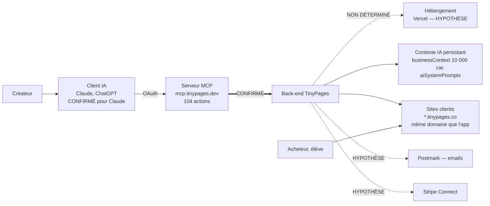

# Synthèse exécutive — audit technique TinyPages

Date de référence : 18 septembre 2026. Destinataires : investisseurs et auditeur technique mandaté.

> **Base de preuve.** Cet audit a été conduit sans accès réseau aux sites de TinyPages ni à aucune source officielle externe, et sans aucune pièce interne. **Aucune page de TinyPages n'a été ouverte.** La quasi-totalité des constats plafonne donc au statut PROBABLE. Une seule source primaire a été exploitée : le serveur MCP de production, interrogé sur un compte réel avec autorisation écrite. Les constats qui en découlent, préfixés `M-`, sont les seuls CONFIRMÉS — et ce sont aussi les plus lourds. La méthode, ses dérogations et ses limites sont détaillées dans `annexes/methodologie.md`. **Ce dossier est une cartographie externe assortie d'un sondage technique ciblé, pas une due diligence complète.**

## TinyPages en bref

Plateforme marketing tout-en-un pour créateurs, formateurs et coachs : site, pages de vente, produits numériques, espace membre, emails, blog, formulaires. Association des fondateurs en août 2024, lancement en janvier 2025, bascule vers l'IA en 2025. Le différenciateur revendiqué est le pilotage de bout en bout par Claude via un serveur MCP officiel.

Ce pilotage est réel et il est large : **104 actions** sont exposées à l'IA — 47 lectures, 39 écritures, 10 publications, 3 suppressions, 2 envois. C'est un périmètre considérable, et c'est le principal actif technique de la société.

## Architecture, vue d'ensemble

Un seul lien de ce schéma a été exercé. Tout le reste est déduit ou annoncé.

## Ce qui est solide

- **L'étendue du pilotage par IA est réelle et vérifiée.** 104 actions, couvrant pages, produits, espace membre, contacts, emails, automatisations, formulaires, coupons, analytics. Peu de concurrents en font autant dans un seul serveur officiel.
- **Le serveur applique déjà des vérifications par action et par compte.** Les refus `402` observés le prouvent. Le point d'application existe : sécuriser les actions sensibles est une **extension** d'un mécanisme en place, pas une construction de zéro. C'est ce qui rend le plan de remédiation crédible.
- **Le produit est cohérent et livré.** Un compte neuf reçoit 5 pages, 15 modèles dont une séquence de lancement en 7 emails, et un espace membre fonctionnel.
- **L'audit n'a révélé aucune fraude, aucun mensonge délibéré, aucun passif caché.** Les écarts constatés sont des défauts de jeunesse et de priorisation, pas des problèmes de probité.

## Les dix risques majeurs

| # | Risque | Statut | Impact | Traitement |
|---|---|---|---|---|
| 1 | **Publier une page ne passe par aucun contrôle serveur.** Prouvé en violant délibérément la consigne « ne pas publier » : la page est partie en ligne en un appel, depuis un compte gratuit. Les garde-fous annoncés sont du texte adressé à un modèle tiers. | **CONFIRMÉ** | Bloquant | Contrôle serveur sur les actions de publication et d'envoi, limites de débit. 3 j·p, avant la data room |
| 2 | **Les seuls contrôles serveur observés sont commerciaux.** Le bloc de code et l'envoi sont refusés faute de plan Pro ; la publication ne l'est pas. Les contrôles protègent le chiffre d'affaires, pas l'utilisateur. | **CONFIRMÉ** | Bloquant | Même chantier que le risque 1 |
| 3 | **La plateforme publie des pages légales vides sur chaque compte**, indexées, à côté d'un formulaire de collecte d'emails sans double opt-in. Chaque créateur est en écart RGPD art. 12-14 dès l'ouverture. | **CONFIRMÉ** | Élevé | Gabarit réel, publication conditionnée, `noindex`, rétro-traitement du parc. 2 j·p |
| 4 | **Exposition TVA au titre de l'article 9 bis** du règlement UE 282/2011. Si la présomption s'applique, TinyPages est redevable de la TVA de chaque pays d'acheteur sur l'intégralité du volume vendu par ses créateurs. | PROBABLE | Bloquant si avéré | Trois questions de fait tranchent, puis note d'un avocat fiscaliste. 1 j·p + mandat |
| 5 | **L'affirmation « seule plateforme pilotable de bout en bout par Claude » est contredite.** Kajabi, GoHighLevel, ClickFunnels, Stan Store et Systeme.io publient un MCP officiel. Vérifiable par un investisseur en dix minutes. | PROBABLE | Élevé | Reformuler sur la couverture mesurable et la gouvernance vérifiable. 1 j·p |
| 6 | **Application et sites clients partagent le même domaine enregistrable.** `SameSite` est inopérant entre les deux, le cookie tossing devient possible, et un signalement Safe Browsing retirerait d'un coup tout le parc. Toute l'industrie comparable sépare les deux plans. | PROBABLE | Élevé | Verrouillage des cookies en urgence, PSL, puis séparation de domaine en chantier daté |
| 7 | **Injection persistante par le contexte IA.** `businessContext` (10 000 caractères) et `aiSystemPrompts` sont injectés dans toutes les générations futures, modifiables par l'IA, sans contrôle. Une écriture hostile survit à la session et n'apparaît nulle part. | **CONFIRMÉ** pour l'existence | Élevé | Contrôle d'écriture et journalisation. 2 j·p |
| 8 | **Ni évals, ni journal des actions de l'IA, ni annulation.** Tous les garde-fous reposent sur un modèle tiers mis à jour sans préavis, et rien ne permet de savoir après coup ce que l'IA a fait. | Non déterminé | Élevé | Journal horodaté et batterie d'évals minimale. 10 j·p |
| 9 | **Entité juridique non établie**, titularité du code antérieur à l'association non documentée. Point de blocage classique de closing. | Non déterminé | Bloquant en due diligence | Pièces d'entité et recensement des cessions de droits. 3 j·p |
| 10 | **Personne clé.** CTO et CEO sont la même personne. C'est aussi ce qui détermine le délai réel du plan de remédiation. | CONFIRMÉ | Élevé | Documentation de continuité, puis recrutement ou association technique |

## Niveau de préparation par domaine

| Domaine | Niveau | Pourquoi |
|---|---|---|
| Pilotage par IA et MCP | 🔴 Rouge | Le différenciateur du produit est aussi son point le plus faible : garde-fous non appliqués, aucune trace, aucune éval |
| Sécurité et multi-tenance | 🔴 Rouge | Topologie de domaine à corriger, 85 des 97 lignes du questionnaire sans réponse |
| Conformité réglementaire | 🔴 Rouge | Écart RGPD dès l'ouverture d'un compte, AI Act art. 50 déjà applicable, paquet DSA absent |
| Fiscalité et paiements | 🟠 Orange | Une question tranche l'essentiel ; le reste est documentable rapidement |
| Infrastructure | 🟠 Orange | Non pas défaillante, mais **non documentée** : rien n'a pu être vérifié |
| Emails et délivrabilité | 🟠 Orange | Coûts modélisés, authentification et isolation de réputation non vérifiées |
| Fonctionnel | 🟢 Vert | Périmètre large, cohérent, et le catalogue en donne une preuve directe |
| Marché et différenciation | 🟠 Orange | Le marché existe, l'argument d'exclusivité ne tient pas |

Aucun domaine n'est rouge par défaillance technique avérée. Ils le sont parce que **ce qui est annoncé n'est pas appliqué**, ou parce que rien ne permet de le vérifier.

## Recommandation

**Ne pas ouvrir la data room en l'état.** Un auditeur technique reproduira le test de publication en un appel et trouvera l'affirmation « seule plateforme » fausse en dix minutes. Ces deux découvertes, faites par lui plutôt que présentées par la société, coûteraient davantage que les défauts eux-mêmes.

Le plan P0 représente **environ 40 jours-personne**, dont **13,5 tenables en une à deux journées chacun**. Les corrections les plus visibles — pages légales, double opt-in, reformulation du discours, points de contact — sont aussi les moins coûteuses.

Deux sujets ne se referment pas avant l'ouverture : l'isolation de domaine et la qualification TVA. Ils doivent être **exposés chiffrés et datés** dans la data room, pas corrigés dans l'urgence ni dissimulés.

La trajectoire produit est bonne et l'actif technique est réel. Ce qui manque n'est pas de l'ingénierie difficile, c'est de la gouvernance : appliquer côté serveur ce qui est aujourd'hui promis en langage naturel, et tracer ce que l'IA fait. C'est précisément ce qu'un investisseur attend de voir traité avant d'entrer.

## Suite immédiate

1. Traiter les risques 1, 2 et 3 : ce sont des faits établis, pas des hypothèses.
2. Répondre aux trois questions de fait sur l'article 9 bis, puis mandater l'avocat fiscaliste.
3. Reformuler l'argument de différenciation avant toute diffusion.
4. Ouvrir les accès internes et rejouer l'audit : **le réseau fermé et l'absence de pièces internes laissent des trous entiers**, dont l'échantillon de sites clients, l'infrastructure et tout le volet coûts et métriques.
