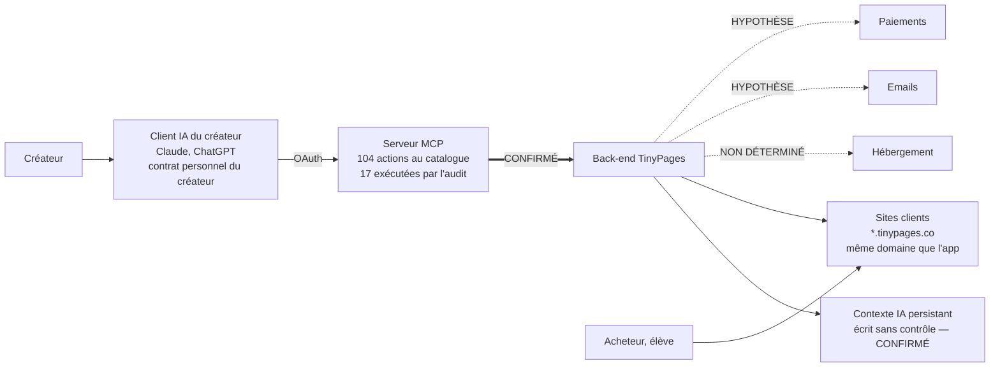

# Synthèse exécutive — audit technique TinyPages

Date de référence : 18 septembre 2026. Version 2, révisée après contre-audit.

> ## Nature de ce document
>
> **Travaux d'auto-évaluation produits en interne pour TinyPages, sans intervention d'un tiers indépendant.** Le commanditaire, l'audité, le relecteur et l'unique responsable des remédiations sont la même personne. **Ces documents ne constituent pas un rapport d'audit au sens professionnel du terme.** Les deux points les plus critiques — le harnais IA et l'isolement multi-locataire — doivent faire l'objet d'un mandat externe dont le rapport sera joint.
>
> ## Base de preuve
>
> L'audit s'est déroulé sans accès réseau aux sites de TinyPages ni à aucune source officielle externe, et sans aucune pièce interne. **Aucune page de TinyPages n'a été ouverte. Aucune pièce d'entreprise n'a été vue.**
>
> Une seule source primaire a été exploitée : le serveur MCP de production, interrogé sur le compte du dirigeant avec autorisation écrite. **17 actions y ont été réellement exécutées, sur un catalogue de 104.** Les 87 autres sont un inventaire de noms publié par le serveur lui-même — source primaire, mais déclarative : c'est TinyPages qui décrit TinyPages, et aucune de ces actions n'a été confrontée à son schéma.
>
> Tout le reste plafonne au statut PROBABLE. La méthode, ses quatre dérogations et ses écarts assumés sont détaillés dans `annexes/methodologie.md`.
>
> **Ce dossier est une note de cadrage assortie d'un sondage technique ciblé. Il ne remplace pas une due diligence, et il n'est pas prêt à être remis en l'état.**

## TinyPages en bref

Plateforme marketing tout-en-un pour créateurs, formateurs et coachs : site, pages de vente, produits numériques, espace membre, emails, blog, formulaires. Association des fondateurs en août 2024, lancement en janvier 2025, bascule vers l'IA en 2025. Le différenciateur revendiqué est le pilotage de bout en bout par Claude via un serveur MCP officiel.

Ce pilotage est réel et son périmètre est large : **104 actions exposées à l'IA** — 47 lectures, 39 écritures, 10 publications, 3 suppressions, 2 envois, 3 utilitaires. C'est le principal actif technique de la société.

## Architecture, vue d'ensemble

Un seul lien de ce schéma a été exercé. Tout le reste est déduit ou annoncé.

## Ce qui est solide

- **L'étendue du pilotage par IA est large et le catalogue est documenté.** 104 actions couvrant pages, produits, espace membre, contacts, emails, automatisations, formulaires, coupons, analytics.
- **Le serveur applique déjà des vérifications par action et par compte.** Les refus `402` observés le prouvent. **Le point d'application existe** : sécuriser les actions sensibles est une extension d'un mécanisme en place, pas une construction de zéro. C'est ce qui rend le plan crédible.
- **Le produit est cohérent et livré.** Un compte neuf reçoit 5 pages, 15 modèles dont une séquence de lancement en 7 emails, et un espace membre fonctionnel.
- **Le dossier établit par test le constat qui le dessert le plus.** C'est une qualité, pas un aveu : un investisseur finance une équipe qui sait dire « nous avons testé, ça ne tient pas, voici le plan ».

> **Périmètre de cette section.** Elle ne porte que sur ce qui a pu être observé, c'est-à-dire le canal MCP. **Aucune conclusion ne peut être tirée de cet audit sur les comptes, les contrats, les engagements, les litiges ou la situation financière de la société : aucune de ces pièces n'a été consultée.**

## Les dix risques majeurs

| # | Risque | Statut | Impact | Traitement et phase |
|---|---|---|---|---|
| 1 | **Publier une page ne passe par aucun contrôle serveur.** Prouvé en violant délibérément la consigne « ne pas publier » : la page est partie en ligne en un appel, depuis un compte gratuit. Les garde-fous annoncés sont du texte adressé à un modèle tiers. | **CONFIRMÉ** | Bloquant | **À l'ouverture de la data room, la publication reste sans contrôle serveur.** P0 livre les limites de débit (3 j·p) et le journal des actions (5 j·p). Le contrôle serveur lui-même est un chantier de **15 j·p, livré avant le closing** |
| 2 | **Les seuls contrôles serveur observés sont commerciaux.** Le bloc de code et l'envoi sont refusés faute de plan Pro ; la publication ne l'est pas. Les contrôles protègent le chiffre d'affaires, pas l'utilisateur. | **CONFIRMÉ** | Bloquant | Même chantier que le risque 1 |
| 3 | **La plateforme publie des pages légales vides sur chaque compte**, indexées, à côté d'un formulaire de collecte d'emails sans double opt-in. Chaque créateur est en écart RGPD art. 12-14 dès l'ouverture. | **CONFIRMÉ** | Élevé | Gabarit réel, publication conditionnée, `noindex`, rétro-traitement du parc. 4 j·p, P0 |
| 4 | **Le contexte de génération persistant s'écrit sans aucun contrôle, et ne s'efface pas.** `businessContext` et `aiSystemPrompts` sont injectés dans toutes les générations futures. L'IA peut y écrire, elle ne peut pas défaire son écriture. | **CONFIRMÉ** | Élevé | Contrôle d'écriture, journalisation, remise à vide possible. P0 |
| 5 | **Exposition TVA au titre de l'article 9 bis** du règlement UE 282/2011. Les trois mêmes faits commandent aussi la qualification comptable principal/agent — qui décide si le chiffre d'affaires se compte brut ou net — et l'identité du vendeur au sens du droit de la consommation. | PROBABLE | Bloquant si avéré | Trois questions de fait, puis mandat unique couvrant les trois qualifications. P0 |
| 6 | **L'affirmation « seule plateforme pilotable de bout en bout par Claude » est contredite.** Sept concurrents publient un MCP officiel. Vérifiable par un investisseur en dix minutes. | PROBABLE | Élevé | Reformuler et produire le comparatif daté avant toute promesse. P0 |
| 7 | **Application et sites clients partagent le même domaine enregistrable.** `SameSite` est inopérant entre les deux, et un signalement Safe Browsing retirerait d'un coup tout le parc. Toute l'industrie comparable sépare les deux plans. | PROBABLE | Élevé | Verrouillage des cookies en P0, séparation de domaine en chantier daté |
| 8 | **AI Act article 50.** L'alinéa 1 est applicable depuis le 2 août 2026 et n'est pas respecté. L'alinéa 2, marquage lisible par machine des contenus générés, tombe le **2 décembre 2026** — pendant la levée, et c'est la seule échéance dure qui demande du développement. | PROBABLE | Élevé | Mention IA en P0, marquage en chantier daté avant le 2 décembre |
| 9 | **Aucun contrat de sous-traitance proposé aux créateurs, et consentement cookies non vérifié.** TinyPages héberge les contacts de ses clients sans DPA constaté. Bloquant en due diligence. | Non déterminé | Bloquant en DD | DPA, liste des sous-traitants, mécanisme de consentement fourni aux créateurs. P0 |
| 10 | **Ni évals, ni journal des actions de l'IA, ni annulation.** Les garde-fous reposent sur un modèle tiers mis à jour sans préavis, et rien ne permet de savoir après coup ce que l'IA a fait. | Non déterminé | Élevé | Journal horodaté et batterie d'évals minimale. 10 j·p, P0 |

**Immédiatement derrière** : aucune preuve de sauvegarde ni de restauration n'a pu être obtenue, ce qui est le trou le plus gênant pour une data room ; l'entité juridique n'est pas établie ; et le CTO et le CEO sont la même personne, ce qui détermine le délai réel de toute remédiation.

## Niveau de préparation par domaine

**Échelle.** 🟢 établi et documenté, preuves disponibles · 🟠 écarts identifiés, correctifs chiffrés et datés · 🔴 écart avéré non corrigé, **ou domaine dont rien n'a pu être établi**.

| Domaine | Niveau | Pourquoi |
|---|---|---|
| Pilotage par IA et MCP | 🔴 | Écarts avérés : publication non contrôlée, contexte persistant non protégé, aucune trace, aucune éval |
| Sécurité et multi-tenance | 🔴 | Topologie de domaine à corriger, et 80 des 97 lignes du questionnaire sans réponse |
| Conformité réglementaire | 🔴 | Écart RGPD avéré dès l'ouverture d'un compte, AI Act art. 50 déjà applicable, paquet DSA absent |
| Infrastructure | 🔴 | **Rien n'a pu être établi** : ni hébergeur, ni CDN, ni base, ni sauvegardes, ni reprise |
| Emails et délivrabilité | 🔴 | **Rien n'a pu être vérifié** : ni authentification des domaines, ni isolation de réputation |
| Fiscalité et paiements | 🟠 | Une question tranche l'essentiel, le reste est documentable rapidement |
| Fonctionnel | 🟠 | Le catalogue donne une ossature solide, mais **aucune page d'interface n'a été ouverte** |
| Marché et différenciation | 🟠 | Le marché existe, l'argument d'exclusivité ne tient pas |

Cinq domaines sur huit sont rouges. Trois le sont par écart avéré, deux parce que **rien n'a pu être établi** — et dans une data room, l'absence de preuve se traite comme un défaut jusqu'à preuve du contraire.

## Recommandation

**Ne pas ouvrir la data room en l'état, et ne pas diffuser ces documents avant les corrections listées ci-dessous.**

Un auditeur technique reproduira le test de publication en un appel et trouvera l'affirmation « seule plateforme » fausse en dix minutes. Ces deux découvertes, faites par lui plutôt que présentées par la société, coûteraient davantage que les défauts eux-mêmes.

**Ordre de traitement, établi par le contre-audit :**

1. **48 heures, sans dépendance externe.** Réécrire les formulations qui engagent, marquer la diffusion de chaque pièce, recompter ce qui doit l'être. Les registres et le document de questions-réponses **ne sont pas remis aux investisseurs** : ils contiennent l'identité et le compte personnel du dirigeant, et un manuel de formulations.
2. **Semaine 1.** Régulariser la chaîne de garde de la preuve : dérogation écrite, locataire de test dédié en gratuit et en Pro, **rejeu horodaté des trois tests décisifs**, suppression des traces laissées par l'audit. Une heure de travail retire une objection de recevabilité.
3. **Semaines 1 et 2, et cela prime sur tout le reste. Rejouer la collecte avec un accès réseau ouvert.** Une demi-journée d'outils referme la moitié des « Non déterminé », dont les quatre relevés qui décident si trois risques majeurs sont théoriques ou réels.
4. **Semaines 2 à 4.** Les pièces de société, qui ne demandent qu'une extraction. Le mandat unique au conseil, couvrant les trois qualifications. Les vérifications produit d'une heure chacune. Et la reprise du plan avec un chemin critique, un coût en euros et une hypothèse de renfort chiffrée.

**Sur l'effort.** Le plan P0 représente environ 40 jours-personne, dont 13,5 en actions courtes d'une à deux journées chacune. Mais P0 et P1 cumulés atteignent près de 200 jours-personne, soit environ 39 semaines pour une personne seule en pleine levée. **Ce n'est pas tenable sans renfort, et c'est la première chose qu'un investisseur calculera.** Mieux vaut présenter l'hypothèse de renfort chiffrée comme un usage des fonds que laisser découvrir l'arithmétique.

## Pour finir

La trajectoire produit est bonne et l'actif technique est réel. Ce qui manque n'est pas de l'ingénierie difficile : c'est de la gouvernance. Appliquer côté serveur ce qui est aujourd'hui promis en langage naturel, tracer ce que l'IA fait, et documenter ce qui existe déjà.

Le principal risque de ce dossier n'est aucun des dix ci-dessus. C'est l'écart entre ce que les documents détaillés établissent et ce que le document de tête laisse entendre. Cette version corrige cet écart ; toute réécriture ultérieure devra le préserver.
