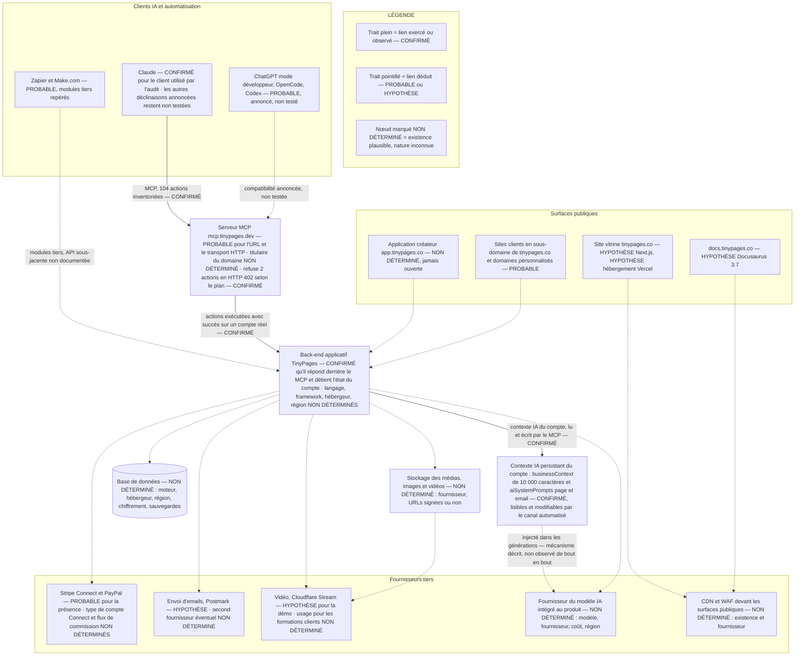

# 02 — Analyse technique

Data room TinyPages · Date de référence : 18 septembre 2026 · Rédigé par l'orchestrateur d'audit (A00) à partir des rapports A01 à A09 et des annexes MCP.

---

> ## Base de preuve et limites — à lire avant toute autre page
>
> **Ce document ne repose presque sur aucune observation directe de la plateforme.** L'audit a tourné en mode dégradé : la politique réseau de l'environnement a refusé toute sortie HTTP vers les domaines utiles (403 du proxy au CONNECT, relevé le 18/09/2026). **Aucune page de TinyPages n'a été ouverte** — ni le site, ni l'application, ni la documentation. `dig` et `whois` étaient absents du conteneur. Wayback Machine, crt.sh, PageSpeed Insights et les documentations des fournisseurs : inaccessibles.
>
> **Ce qui est CONFIRMÉ** — et rien d'autre : ce qui provient de l'exécution réelle du serveur MCP TinyPages sur le compte connecté, consigné dans `audit/annexes/catalogue_mcp_tinypages.md` et `audit/annexes/screening_mcp_compte_test.md`, constats préfixés **M-**. Cela couvre l'inventaire des 104 actions exposées à l'IA, l'état par défaut d'un compte à sa création et, depuis les tests d'exécution du 18/09/2026 entre 20:15 et 20:23 UTC menés sous dérogation du dirigeant, **le comportement réel des actions de publication et d'envoi**.
>
> **Le compte testé est en plan gratuit**, établi par deux refus du serveur en HTTP 402. C'est la seule source de limites de plan réelles dont dispose cet audit : partout ailleurs, les plans et leurs limites restent non vérifiés.
>
> **Ce qui n'est pas confirmé** : tout le reste. Hébergeur, CDN, WAF, version du framework, base de données, région de stockage, fournisseur vidéo, fournisseur d'emails, configuration Stripe, sauvegardes, supervision, CI/CD, coûts réels. Les constats issus de WebSearch sont des **sources secondaires reformulées par un moteur**, plafonnées à PROBABLE ou HYPOTHÈSE. Le rapport A09 a montré que ces résumés contiennent parfois des chiffres fabriqués : aucun chiffre n'est repris ici sans source identifiée, et les trous restent des trous.
>
> **Réserve supplémentaire sur le compte MCP.** Le compte déclaré « compte de test dédié » s'est révélé, à la lecture de `get_account`, porter le nom réel et l'adresse personnelle réelle du dirigeant, avec des brouillons créés pendant la session. Les relevés M- portent sur le **comportement par défaut de la plateforme**, pas sur des données clientes, mais le garde-fou « jamais de compte réel » n'a été respecté qu'imparfaitement. Signalé au contre-audit.
>
> **Convention de lecture.** Chaque affirmation porte son statut : **CONFIRMÉ** (source primaire ou test reproductible), **PROBABLE** (indices convergents), **HYPOTHÈSE** (à confirmer en interne), **CONTREDIT**, **Non déterminé**. Une case vide ou « Non déterminé » est un constat assumé, pas un oubli. La section 12 donne, pour chaque trou, la commande ou la pièce qui le comble.

---

## 1. Schéma d'architecture

Le schéma ci-dessous n'est **pas** un schéma d'architecture fourni par TinyPages : c'est une reconstitution d'audit. Le statut de chaque composant et de chaque lien est porté dans le schéma lui-même. Un seul chemin est confirmé : celui du serveur MCP vers le back-end applicatif, parce qu'il a été exercé.

**Ce que le schéma ne dit pas, et qu'un investisseur doit savoir.** Il ne dit pas où tournent les serveurs, ni dans quelle région les données sont stockées, ni s'il existe un environnement de préproduction, ni s'il existe une sauvegarde. Ces cases ne sont pas vides par prudence rédactionnelle : elles sont vides parce que rien, dans cet audit, ne permet de les remplir.

---

## 2. Tableau de stack

| Composant | Technologie | Fournisseur | Preuve | Statut |
|---|---|---|---|---|
| Serveur MCP | Transport HTTP, catalogue à deux niveaux : 24 outils directs + 80 actions via `search_actions` puis `execute_action` | TinyPages, domaine `tinypages.dev` | Inventaire exécuté du catalogue, `audit/annexes/catalogue_mcp_tinypages.md`, 18/09/2026 ; commande d'ajout `claude mcp add --transport http` citée par des sources indexées (A01-003) | **CONFIRMÉ** pour le catalogue et sa structure ; **PROBABLE** pour l'URL et le transport |
| Back-end applicatif | Non déterminé | Non déterminé | Le MCP a exécuté `get_account`, `list_accounts`, des lectures de pages et de contacts : un back-end répond et détient l'état du compte | **CONFIRMÉ** pour l'existence ; **Non déterminé** pour la technologie |
| Base de données | Non déterminé | Non déterminé | — | **Non déterminé** |
| Front vitrine | Next.js, chemins `/_next/image` | Non déterminé | Point de départ de l'audit, non vérifié cette session (A01-002) | **HYPOTHÈSE** |
| Hébergement du front | Vercel | Vercel | Alias `tinypages.vercel.app` remonté par WebSearch, page non ouverte (A01-001) ; en-têtes HTTP jamais relevés | **HYPOTHÈSE** |
| CDN et WAF | Non déterminé | Non déterminé | Aucun en-tête HTTP relevé (A01-Q1) | **Non déterminé** |
| Documentation | Docusaurus 3.7, EN et FR | Auto-hébergé ou non déterminé | Point de départ de l'audit, non vérifié | **HYPOTHÈSE** |
| Paiements | Stripe Connect, connexion par redirection ; PayPal annoncé | Stripe, PayPal | Point de départ ; A02 n'a pu ouvrir aucune page de paiement ni la documentation « Connect Stripe » | **PROBABLE** pour la présence de Stripe ; **Non déterminé** pour le type de compte Connect, le mécanisme de commission et le porteur des litiges |
| Emails | Postmark | Postmark | Point de départ, non vérifié ; aucun relevé SPF, DKIM ou DMARC possible (A03-Q1) | **HYPOTHÈSE** |
| Vidéo | Cloudflare Stream | Cloudflare | Vu pour la vidéo de démo selon le point de départ ; aucune preuve pour les formations clients (A01-004) | **HYPOTHÈSE** pour la démo ; **Non déterminé** pour les formations clients |
| Stockage des médias | Non déterminé | Non déterminé | Le catalogue MCP expose `list_images`, `get_image`, `list_videos`, `get_video` : un stockage existe et est interrogeable | **CONFIRMÉ** pour l'existence d'un stockage média ; **Non déterminé** pour le fournisseur et la signature des URLs |
| Modèle IA intégré au produit | Non déterminé | Non déterminé | A04-Q8 sans réponse | **Non déterminé** |
| Contexte IA persistant du compte | Champ `businessContext` de 10 000 caractères et champ `aiSystemPrompts` à deux entrées, `webpage` et `email` | TinyPages | Lecture par `get_business_context`, écriture exposée par `update_business_context`, 18/09/2026 ; les deux champs étaient vides sur le compte observé | **CONFIRMÉ** pour l'existence et pour l'accessibilité en écriture par le canal automatisé (M-015) |
| Contrôles serveur par plan | Refus en HTTP 402 `PRO_PLAN_REQUIRED` sur deux actions | TinyPages | Tests d'exécution du 18/09/2026 : `create_webpage` avec bloc `codeHtmlBlock` et `send_email` refusés ; publication acceptée | **CONFIRMÉ** (M-011) |
| DNS, registrar, certificats | Non déterminé | Non déterminé | `dig` et `whois` absents, crt.sh bloqué (A01-Q3, A01-Q4) | **Non déterminé** |
| Automatisation tierce | Modules Zapier et Make.com | Zapier, Make | Fiches d'intégration remontées par WebSearch, non ouvertes (A07) | **PROBABLE** |
| API publique REST | Aucune documentation localisée | — | Recherche A07 sans résultat ; l'existence de modules Zapier et Make suggère une interface applicative, sans preuve de son caractère public | **Non déterminé** |
| CI/CD, tests, préproduction | Non déterminé | Non déterminé | Aucun dépôt public de la société identifié ; le dépôt GitHub homonyme `Borrus-sudo/tinypages` est sans rapport (A01-009) | **Non déterminé** |

---

## 3. Flux clés

Cinq flux étaient à documenter. Un seul a été exercé.

### 3.1 Action pilotée par l'IA via MCP — **partiellement CONFIRMÉ**

Chaîne observée : client MCP → autorisation → `search_actions` pour obtenir l'identifiant et le schéma d'une action → `execute_action` pour l'exécuter → back-end TinyPages → objet créé ou lu sur le compte. Les 24 outils directs court-circuitent la première étape.

Cinq propriétés de ce flux sont confirmées, dont trois par exécution le 18/09/2026 :

- **M-006.** Toute action hors des 24 outils directs passe par le même point d'entrée `execute_action`. Un client MCP demande le consentement **par outil** : une seule autorisation permanente sur `execute_action` couvre les 80 actions du catalogue interne, dont les 10 actions de publication, les 3 de suppression et les 2 d'envoi. Le consentement granulaire du client est structurellement contourné. **CONFIRMÉ** pour la structure ; le comportement réel du client n'a pas été testé.
- **M-001.** Le catalogue contient `send_email` et `schedule_email`, ainsi que `publish_webpage`, `publish_blog_post`, `publish_lesson`, `publish_all_lessons`, `publish_form`, `publish_automation_email` et quatre actions de dépublication. **CONFIRMÉ** pour l'existence de ces actions.
- **M-010. Les garde-fous de publication ne sont pas appliqués par le serveur.** Le test a consisté à appeler `publish_webpage` en violant délibérément la consigne « Do NOT call publish_webpage » inscrite dans la description de l'outil. Résultat : **publication immédiate, URL publique retournée**, aucune confirmation demandée, aucune revue, aucun délai, aucune restriction de plan. Les mentions « enregistré comme brouillon » ou « l'utilisateur décide quand publier » sont donc **exclusivement du texte adressé à un modèle que TinyPages ne contrôle pas**. **CONFIRMÉ.** Formulation défendable en data room : comportement par défaut du modèle, jamais contrôle d'accès.
- **M-011. Le serveur sait refuser, et il refuse pour des motifs commerciaux.** Deux actions retournent `402 PRO_PLAN_REQUIRED` sur le compte en plan gratuit : `create_webpage` portant un bloc `codeHtmlBlock`, et `send_email`. **CONFIRMÉ.** Le contrôle d'accès existe donc bien dans l'architecture ; il est branché sur la facturation, pas sur le risque. L'action la plus exploitable pour l'abus — publier une page publique sur un sous-domaine de la marque — est la seule des trois à n'avoir aucune barrière.
- **M-014. L'IA ne peut pas revenir en arrière.** Aucune action ne supprime une page ni un email : les deux objets créés pendant les tests subsistent en brouillon et doivent être supprimés à la main dans l'interface. **CONFIRMÉ.**

### 3.2 Publication d'une page — **CONFIRMÉ pour le déclenchement, Non déterminé pour la chaîne de diffusion**

Le flux a été exercé de bout en bout par le canal automatisé, sur un compte en plan gratuit : création d'un brouillon par `create_webpage`, puis `publish_webpage` — **succès immédiat, URL publique retournée** — puis `unpublish_webpage`, succès également (**M-010, CONFIRMÉ**). Deux conséquences techniques : la publication ne passe par aucune validation, et elle n'est pas conditionnée au plan.

Ce qui se passe **après** l'appel — rendu statique ou dynamique, invalidation de cache, propagation CDN, délai de mise en ligne, génération de certificat pour un domaine personnalisé — n'a pas été observé et reste **Non déterminé**.

Un élément est toutefois confirmé sur l'état initial d'un compte (**M-007**) : à la création, TinyPages crée et **publie automatiquement** cinq pages, dont une politique de confidentialité et des conditions d'utilisation réduites à leur seul titre HTML, avec `indexed: true`. La page d'accueil par défaut est publiée et porte un bloc de capture d'emails actif, tandis que le compte porte `doubleOptin: false`. Techniquement, cela signifie que la publication ne requiert aucune action du créateur et que l'indexation est demandée par défaut.

### 3.3 Paiement — **Non déterminé**

Aucune page de paiement n'a pu être observée, aucun compte Stripe en mode test n'existait. Le type de compte Connect, le mécanisme de prélèvement de la commission annoncée à 15 % sur le plan gratuit, le porteur des litiges et des soldes négatifs, le périmètre PCI DSS : tous **Non déterminés** (A02). Le catalogue MCP, lui, ne contient **aucune** action touchant aux paiements, à la connexion Stripe ou aux remboursements (**M-003, CONFIRMÉ**) : l'argent n'est pas pilotable par l'IA.

Une anomalie mineure a été relevée sur le compte (**M-009, à vérifier**) : un produit à 100 avec 3 échéances de 33, soit 99. Sans connaître la règle d'arrondi de la dernière échéance, il n'est pas possible de dire s'il s'agit d'un défaut d'arrondi ou d'un affichage tronqué.

### 3.4 Email — **CONFIRMÉ pour la surface d'action et pour la barrière de plan, Non déterminé pour l'infrastructure**

Le catalogue expose 21 actions liées aux emails et automatisations, dont l'envoi et la programmation (**CONFIRMÉ**). L'envoi a été testé : `send_email` est **refusé en plan gratuit**, avec un `402 PRO_PLAN_REQUIRED` indiquant qu'un plan Pro est requis pour envoyer par l'interface programmatique (**M-011, CONFIRMÉ**). Le message d'erreur implique qu'un compte Pro enverrait sans autre contrôle : **le comportement sur un compte Pro n'a pas été testé** et c'est la seule question que les tests laissent ouverte sur ce point. En revanche : quel fournisseur achemine réellement, quels flux transactionnel et marketing sont séparés, comment les domaines des créateurs sont authentifiés en SPF, DKIM et DMARC, comment la réputation est isolée entre créateurs, quelle liste de suppression est partagée ou non — **tous Non déterminés** (A03-Q1 à Q4). Aucun relevé DNS n'a été possible.

Le point qui mérite l'attention de l'auditeur : une plateforme multi-locataire qui envoie pour le compte de tiers sans isolation de réputation expose l'ensemble du parc à l'incident d'un seul créateur. L'existence ou l'absence de cette isolation chez TinyPages est inconnue.

### 3.5 Vidéo — **Non déterminé**

Le catalogue permet de lister et de lire des vidéos, pas d'en téléverser (**CONFIRMÉ** sur l'inventaire). Le fournisseur réel pour les formations clients, et surtout le caractère signé et expirant ou non des URLs de lecture, restent inconnus (A01-Q6). Si les URLs ne sont pas signées, le contenu payant des créateurs est exposé — c'est un risque à impact élevé, dont l'état est aujourd'hui indéterminé.

---

## 4. Multi-tenance et domaines

| Élément | État | Statut |
|---|---|---|
| Sites clients servis en sous-domaines de `tinypages.co`, aux côtés de `app.`, `docs.` et du site vitrine | Quatre hôtes distincts sur le même domaine enregistrable remontés par WebSearch | **PROBABLE** (A05-001) |
| Inscription de `tinypages.co` à la Public Suffix List | Non vérifiée, liste inaccessible | **Non déterminé** (A05-Q4) |
| Conséquence : partage du périmètre des cookies et de la protection SameSite entre l'application et les sites clients | Raisonnement standard, applicable si le point précédent est confirmé | **PROBABLE**, conditionnel |
| Bloc de code personnalisé acceptant HTML et JavaScript bruts, annoncé comme exécuté dans une iframe sandbox « sur une origine séparée » | Le bloc existe mais est **réservé au plan payant** : `create_webpage` avec un bloc `codeHtmlBlock` est refusé en `402 PRO_PLAN_REQUIRED` sur un compte gratuit. L'isolation elle-même n'a jamais été testée | **CONFIRMÉ** pour la réservation au plan payant (M-011) ; **Non déterminé** pour l'efficacité de l'isolation |
| Publication d'une page publique par le canal automatisé, sur un compte gratuit, sans contrôle ni confirmation | Exercée avec succès le 18/09/2026 | **CONFIRMÉ** (M-010) |
| Vecteur d'abus à grande échelle | **Correction au rapport A05** : la combinaison qu'il retenait — plan gratuit + code personnalisé + pilotage par IA — ne tient pas, le code personnalisé étant payant. Le risque se reformule : **plan gratuit + pilotage par IA + publication sans aucun contrôle**. Une page trompeuse sans JavaScript, sur un sous-domaine de la marque avec certificat valide, reste créable et publiable en deux appels | **CONFIRMÉ** pour les deux mécanismes (M-011, M-012) ; la faisabilité d'un abus réel n'a pas été mise à l'épreuve, et ne doit pas l'être |
| Domaines personnalisés des créateurs : mode de pointage DNS, émetteur des certificats, traitement des domaines orphelins | Aucun relevé possible | **Non déterminé** (A01-Q4) |
| Réutilisation d'un identifiant de sous-domaine libéré par un créateur parti | Risque théorique identifié, état réel inconnu | **Non déterminé** |
| Multi-comptes : `switch_account` et `list_accounts` existent, `subAccounts` vide sur le compte observé | La mécanique existe et est pilotable par l'IA ; son cloisonnement n'a pas pu être éprouvé faute d'un second compte | **CONFIRMÉ** pour l'existence (M-005, M-008) ; **Non déterminé** pour l'étanchéité et la portée de l'autorisation OAuth entre comptes |
| Séparation du serveur MCP sur `mcp.tinypages.dev`, domaine distinct de la marque | Va dans le sens du cloisonnement ; appartenance à la même entité non établie | **PROBABLE** pour la séparation ; **Non déterminé** pour le titulaire |

**Lecture.** La question de multi-tenance la plus lourde pour un auditeur n'est pas un en-tête de sécurité manquant, c'est le choix de servir les sites clients sous le même domaine enregistrable que l'application. Ce choix est **probable**, pas confirmé, parce qu'aucun en-tête n'a pu être relevé. Il doit être vérifié en premier à la réouverture du réseau.

---

## 5. Données

| Question | Réponse | Statut |
|---|---|---|
| Quelles données personnelles la plateforme détient-elle ? | Contacts des créateurs, soumissions de formulaires, destinataires d'emails, membres des produits — le catalogue MCP expose `list_contacts`, `search_contacts`, `create_contact`, `update_contact`, `list_form_submissions`, `list_email_recipients`, `list_automation_email_recipients`, `list_product_members` | **CONFIRMÉ** (M-004) |
| Une IA connectée peut-elle lire ces données ? | Oui. C'est une conséquence directe de l'inventaire | **CONFIRMÉ** (M-004) |
| Ces champs sont-ils alimentés par des tiers non authentifiés ? | Oui pour les soumissions de formulaires publics — surface d'injection indirecte à traiter dans le livrable 05 | **CONFIRMÉ** pour le mécanisme |
| Moteur de base de données, hébergeur, région | — | **Non déterminé** |
| Chiffrement au repos et en transit | — | **Non déterminé** |
| Politique de sauvegarde, RPO, RPO testé, restauration éprouvée | — | **Non déterminé** |
| Durées de conservation, purge, suppression d'un compte | — | **Non déterminé** |
| Export des données par le créateur | Aucune action d'export dans le catalogue MCP | **CONFIRMÉ** pour l'absence côté MCP ; **Non déterminé** pour l'interface web |
| Double opt-in par défaut | `doubleOptin: false` sur le compte observé, contact enregistré `isSubscribed: true` sans étape de confirmation | **CONFIRMÉ** sur ce compte, à la date d'observation |
| Contexte IA persistant du compte | `businessContext`, champ libre de 10 000 caractères, et `aiSystemPrompts` à deux entrées, lisibles et modifiables par le canal automatisé. Ce sont des instructions injectées dans toutes les générations futures : qui obtient une écriture sur ces champs oriente durablement ce que l'IA produit pour ce créateur, sans trace dans le contenu généré | **CONFIRMÉ** pour l'existence et l'accès en écriture (M-015) ; portée exacte de l'injection **Non déterminée** |
| Suppression d'une page ou d'un email par le canal automatisé | Impossible, l'action n'existe pas. Deux objets créés pendant les tests subsistent en brouillon et doivent être supprimés à la main | **CONFIRMÉ** (M-014) |
| Métriques commerciales exposées au canal automatisé | `get_analytics_summary` renvoie visiteurs, contacts, ventes et revenus sur une période | **CONFIRMÉ** (M-017) |

**Le trou le plus gênant pour une data room.** Sauvegardes, restauration et région de stockage sont trois questions auxquelles tout auditeur technique demandera une réponse documentée dans les premières heures. Cet audit n'apporte aucun élément sur les trois.

---

## 6. Scalabilité

Aucune mesure n'a été possible : pas de test de charge (interdit par les garde-fous), pas de mesure PageSpeed (API bloquée), aucune métrique interne, aucun chiffre d'usage public fiable.

| Question | Statut |
|---|---|
| Nombre de comptes actifs, de sites publiés, de pages servies | **Non déterminé** (A09-020) |
| Volume mensuel d'emails | **Non déterminé** |
| Volume de paiements traité | **Non déterminé** |
| Temps de réponse, disponibilité mesurée, engagement de disponibilité | **Non déterminé** |
| Modèle de montée en charge : sans état ou avec état, file d'attente, tâches planifiées | **Non déterminé** |
| Limites de débit sur l'API et le MCP | **Non déterminé** (A04) |
| Trafic estimé du site | **Non déterminé** — l'outil d'estimation identifié n'a pas pu être consulté (A09-019) |

Le seul élément dimensionnant disponible est indirect : un signal, non vérifié, indiquait que le fondateur envoyait encore ses emails à plus de 70 000 contacts via un outil tiers, avec migration prévue vers TinyPages. Sa véracité et sa date sont **Non déterminées** (A03-Q6). Il sert ici uniquement de profil de charge pour la section 11, explicitement à titre d'hypothèse.

---

## 7. Observabilité et CI/CD

| Élément | Statut |
|---|---|
| Supervision applicative, alerting, astreinte | **Non déterminé** |
| Journalisation des actions, notamment des actions faites par l'IA | **Non déterminé** — question A04-Q4 restée sans réponse. Le catalogue MCP ne contient aucune action de lecture d'un journal d'audit, ni d'annulation d'une action précédente (**CONFIRMÉ** sur l'inventaire) |
| Traçabilité d'une publication ou d'un envoi déclenché par l'IA, du point de vue du créateur | **Non déterminé** |
| Page d'état publique, historique d'incidents | **Non déterminé** |
| `/.well-known/security.txt`, canal de signalement de vulnérabilité | **Non déterminé** (A01-010) ; aucune page de sécurité publique n'est ressortie des recherches |
| Intégration et déploiement continus, tests automatisés, préproduction, revue de code | **Non déterminé** |
| Batterie d'évaluations rejouée à chaque changement de modèle IA | **Non déterminé** (A04-Q9) |

**Constat d'audit.** L'absence de matériel public sur ces sujets n'est pas la preuve d'une absence de pratique. Mais pour une data room, l'absence de pièce est traitée comme un écart tant que la pièce n'est pas produite.

---

## 8. Dette technique

Les points ci-dessous sont des dettes **établies** ou **plausibles**. Leur statut est indiqué. Aucune n'est extrapolée à partir d'un chiffre inventé.

| # | Dette | Statut | Pourquoi c'est une dette |
|---|---|---|---|
| D1 | Les pages légales créées et publiées par défaut sur chaque compte sont vides — un titre HTML, rien d'autre — et demandées à l'indexation, alors que la page d'accueil par défaut collecte des emails sans double opt-in | **CONFIRMÉ** (M-007) | C'est un défaut de produit livré à chaque nouveau compte, pas un cas limite. Il crée un écart réglementaire pour le créateur dès la première seconde, et duplique du contenu vide sur tout le domaine partagé |
| D2 | Un point d'entrée unique `execute_action` couvre 80 actions, dont publier, supprimer et envoyer | **CONFIRMÉ** (M-006) | Le modèle de consentement des clients MCP est neutralisé par construction. Corriger cela demande de découper le catalogue, donc de refaire la surface d'API MCP |
| D3 | Les garde-fous de publication vivent dans des descriptions en langage naturel adressées au modèle, et rien ne les applique côté serveur | **CONFIRMÉ** (M-010) | Un garde-fou formulé en langage naturel s'écrase d'une phrase de l'utilisateur. Le test l'a démontré : la consigne a été délibérément violée et la page a été publiée. Toute présentation de ces consignes comme une garantie sera démentie en un appel par l'auditeur du fonds |
| D9 | Les deux seuls contrôles serveur observés sont des barrières de facturation, pas des barrières de risque | **CONFIRMÉ** (M-011) | La brique de contrôle d'accès existe et fonctionne : elle n'est simplement pas branchée sur les actions à risque. Le coût de la remédiation est donc faible, ce qui rend l'écart d'autant plus visible |
| D10 | Aucune action ne permet de supprimer une page ou un email créés par l'IA | **CONFIRMÉ** (M-014) | Le canal automatisé produit des objets qu'il ne peut pas retirer. Si la limite vaut aussi en interface, l'exécution d'une demande d'effacement devient un problème — point traité au livrable 04 |
| D11 | Les champs `businessContext` et `aiSystemPrompts` sont modifiables par le canal automatisé et orientent toutes les générations suivantes | **CONFIRMÉ** pour le mécanisme (M-015) | Instructions persistantes sans trace visible dans le contenu produit. À traiter comme un composant d'architecture soumis à contrôle d'accès, pas comme un champ de préférences |
| D4 | La documentation officielle contredit le produit sur l'envoi d'emails par l'IA | **CONFIRMÉ** pour l'existence des actions d'envoi (M-001) ; la page de documentation n'a pas pu être relue cette session | Une documentation fausse ou périmée sur une capacité centrale est une dette de confiance, et un point que l'auditeur relèvera immédiatement |
| D5 | Sites clients et application probablement servis sous le même domaine enregistrable | **PROBABLE** (A05-001) | Corriger après coup impose une migration de domaine pour tous les sites clients, avec impact SEO et redirections |
| D6 | Asymétrie de l'inventaire : `publish_form` existe sans `unpublish_form` | **CONFIRMÉ** sur l'inventaire | L'IA peut mettre un formulaire en ligne sans pouvoir le retirer. Symptôme d'un catalogue construit par ajouts successifs plutôt que par couverture systématique |
| D7 | Alias `tinypages.vercel.app` accessible en parallèle du domaine de marque | **HYPOTHÈSE** (A01-001) | Si l'alias est actif, il expose potentiellement l'application sans la protection éventuellement placée devant le domaine principal, et brouille la marque |
| D8 | Aucune action MCP ne couvre le domaine personnalisé, le paiement, les remboursements, l'export, ni les réglages de sécurité | **CONFIRMÉ** (M-003) | Ce n'est pas une dette de sécurité, c'est une dette de promesse : le « pilotage de bout en bout » s'arrête avant l'administration du compte et avant l'argent |

---

## 9. Matrice des dépendances : criticité × substituabilité

Criticité = conséquence d'une indisponibilité ou d'une rupture pour le service rendu au créateur. Substituabilité = facilité de remplacement, en tenant compte de la migration des données et des contrats.

| Dépendance | Statut de la dépendance elle-même | Criticité | Substituabilité | Commentaire |
|---|---|---|---|---|
| Stripe | **PROBABLE** | Bloquante — sans elle, plus aucune vente | Faible — migrer des comptes connectés impose de réonboarder chaque créateur | Le type de compte Connect détermine qui porte litiges et soldes négatifs. **Non déterminé** : c'est la première pièce à produire |
| Fournisseur d'envoi d'emails, Postmark supposé | **HYPOTHÈSE** | Élevée — le module email est un pilier du produit | Moyenne techniquement, faible en pratique : la réputation d'envoi se reconstruit lentement | Le risque n'est pas le contrat, c'est la délivrabilité pendant la bascule |
| Hébergement du front, Vercel supposé | **HYPOTHÈSE** | Élevée | Moyenne à élevée selon le couplage aux fonctions propriétaires de la plateforme | Impossible à qualifier sans en-têtes HTTP |
| Fournisseur vidéo | **HYPOTHÈSE** | Élevée pour les formations | Moyenne — ré-encodage et réécriture des liens | Le point critique est la signature des URLs, **Non déterminé** |
| Fournisseur du modèle IA | **Non déterminé** | Élevée — l'IA est le positionnement du produit | **Non déterminé** — dépend du couplage aux capacités propres d'un fournisseur | Ni le modèle, ni le fournisseur, ni le coût ne sont connus. Trou majeur pour une levée qui met l'IA au centre |
| Clients MCP tiers, Claude et autres | **PROBABLE** | Élevée — ils constituent le canal d'usage revendiqué | Faible — TinyPages ne contrôle ni leur modèle de consentement, ni leur politique d'annuaire, ni leur feuille de route | Dépendance de distribution : un changement de politique côté éditeur de modèle modifie l'expérience sans préavis |
| Base de données et son hébergeur | **Non déterminé** | Bloquante | **Non déterminé** | — |
| DNS, registrar, autorité de certification | **Non déterminé** | Bloquante | Moyenne | Non observable sans `dig` ni `whois` |
| Zapier et Make | **PROBABLE** | Faible | Élevée | Canal d'intégration secondaire |
| Personne clé | Les sources publiques nomment deux cofondateurs, dont un désigné publiquement comme directeur technique — **PROBABLE**, non confirmé ; les paramètres de l'audit désignent une seule et même personne comme directeur technique et directeur général | Élevée | Faible à court terme | Incohérence entre sources publiques et paramètres internes à lever avant la data room. Aucun effectif technique n'a pu être établi |

---

## 10. Coûts unitaires

### 10.1 Coût d'envoi d'un email — seul coût unitaire chiffré de cet audit

Le rapport A03 est le seul à avoir pu produire un chiffrage. Ses hypothèses sont reprises telles quelles, sans les retoucher.

**Base tarifaire retenue — statut PROBABLE.** Grille publique 2026 du fournisseur d'envoi supposé, relevée via des agrégateurs tiers, la page tarifaire officielle n'ayant pas pu être ouverte :

| Plan | Abonnement mensuel | Emails inclus | Coût des 1 000 emails supplémentaires |
|---|---|---|---|
| Basic | 15 $ | 10 000 | 1,80 $ |
| Pro | 16,50 $ | 10 000 | 1,30 $ |
| Platform | 18 $ | 10 000 | 1,20 $ |

**Hypothèse de volume — explicite et non vérifiée.** Un créateur détenant 70 000 contacts et envoyant une newsletter hebdomadaire à sa liste complète, soit 4 envois par mois, soit **280 000 emails par mois**. Ni la taille de liste, ni la fréquence ne sont des données mesurées : la taille vient d'un signal public non vérifié sur la liste du fondateur, la fréquence est posée par l'analyste.

**Calcul.** Emails au-delà de l'inclus : 280 000 − 10 000 = 270 000, soit 270 tranches de mille.

| Plan | Détail | Coût mensuel | Coût pour 1 000 emails effectifs |
|---|---|---|---|
| Basic | 15 + 270 × 1,80 | **501 $** | 1,79 $ |
| Pro | 16,50 + 270 × 1,30 | **367,50 $** | 1,31 $ |
| Platform | 18 + 270 × 1,20 | **342 $** | 1,22 $ |

**Ce que ce calcul vaut, et ce qu'il ne vaut pas.** Il donne un ordre de grandeur du coût d'acheminement d'un créateur à grosse liste, aux tarifs publics. Il ne dit rien du coût réel de TinyPages, qui dépend du plan réellement souscrit, d'éventuelles conditions négociées, du volume agrégé de tout le parc et de la mutualisation des 10 000 emails inclus entre créateurs. La projection sur le parc entier est **impossible** : elle suppose de connaître le nombre de créateurs actifs, la distribution des tailles de liste et la fréquence d'envoi moyenne, trois données absentes.

Formule à appliquer dès que ces données existeront, à recouper avec la facture réelle plutôt qu'à recalculer :

> coût mensuel ≈ Σ sur chaque créateur de [abonnement du plan + max(0 ; emails envoyés dans le mois − 10 000) × tarif de dépassement]

**Précision apportée par les tests d'exécution.** L'envoi d'emails par l'interface programmatique est refusé en plan gratuit et exige un plan payant (**M-011, CONFIRMÉ**). Le profil chiffré ci-dessus est donc nécessairement celui d'un créateur payant : le coût d'acheminement et le revenu d'abonnement portent bien sur le même client, ce qui rend le calcul conditionnel ci-dessous pertinent plutôt qu'académique. Cela ne dit rien du coût des envois déclenchés depuis l'interface web par un créateur en plan gratuit, dont l'existence même n'est pas établie.

**Calcul conditionnel, à manier avec précaution.** Une source secondaire situe le plan payant de TinyPages à 99 $ par mois, avec une tarification par paliers de contacts — **PROBABLE**, jamais vérifié sur la grille officielle. Si ces deux chiffres se confirmaient tels quels, le seul acheminement des emails du profil ci-dessus coûterait entre 3,5 et 5 fois l'abonnement mensuel. Cela ne démontre pas une marge négative : les paliers de contacts évoqués peuvent précisément servir à recouvrir ce coût, et rien n'établit qu'un créateur de ce profil existe dans le parc. **Ce point doit être tranché avec la grille tarifaire réelle et la facture fournisseur, avant la data room** : c'est l'un des premiers calculs qu'un investisseur refera.

### 10.2 Autres coûts unitaires

| Coût unitaire | Valeur | Statut |
|---|---|---|
| Coût d'hébergement par site client publié | — | **Non déterminé** |
| Coût de stockage et de diffusion vidéo par heure visionnée | — | **Non déterminé** |
| Coût d'inférence IA par action pilotée par le MCP | — | **Non déterminé** — ni le modèle, ni le fournisseur, ni le tarif ne sont connus (A04-Q8). Le contexte métier de 10 000 caractères injecté dans les générations est un facteur de coût par appel, non chiffrable ici |
| Frais de traitement des paiements et part revenant à TinyPages | — | **Non déterminé** — le mécanisme de commission n'a pas pu être observé |
| Coût d'infrastructure par compte actif | — | **Non déterminé** |
| Marge brute par plan | — | **Non déterminé** |

Aucune de ces lignes n'est estimée. Les estimer à partir des sources disponibles reviendrait à fabriquer des chiffres, ce que cet audit s'interdit.

---

## 11. Synthèse des statuts par domaine technique

| Domaine | Ce qui est établi | Niveau de preuve dominant |
|---|---|---|
| Surface d'action exposée à l'IA | Inventaire complet de 104 actions, leur classification et leurs propriétés structurantes | **CONFIRMÉ** |
| Garde-fous d'exécution | La publication s'exécute sans contrôle ; deux actions seulement sont refusées, pour motif de plan | **CONFIRMÉ** |
| Limites de plan réelles | Bloc de code personnalisé et envoi d'emails réservés au plan payant, sur un compte gratuit testé | **CONFIRMÉ** pour ces deux actions ; le reste de la grille demeure non vérifié |
| État par défaut d'un compte à sa création | Cinq pages publiées automatiquement, deux documents légaux vides et indexés, capture d'emails active, double opt-in désactivé | **CONFIRMÉ** sur un compte, à une date |
| Multi-tenance et domaines | Un faisceau d'indices, aucun relevé | **PROBABLE** |
| Front, hébergement, CDN, WAF | Un alias et un chemin d'URL | **HYPOTHÈSE** |
| Paiements | Le cadre d'exigences, aucun fait observé | **Non déterminé** |
| Emails, infrastructure et délivrabilité | Le cadre d'exigences et une grille tarifaire publique, aucun relevé DNS | **Non déterminé** |
| Données, sauvegardes, conservation | Rien | **Non déterminé** |
| Scalabilité, observabilité, CI/CD | Rien | **Non déterminé** |
| Coûts | Un seul coût unitaire, sous hypothèses explicites | **PROBABLE** |

---

## 12. Ce qu'il faut faire pour que ce document devienne opposable

Deux chantiers, dans cet ordre.

**A. Rouvrir le réseau et rejouer la collecte.** La quasi-totalité des « Non déterminé » de ce document se comble en une session d'outils, sans rien demander à personne :

| Trou | Commande ou source |
|---|---|
| Hébergeur, CDN, WAF, framework | `curl -sI` sur le site, l'application et la documentation ; lecture du manifeste de build |
| Sous-domaines clients et leur ancienneté | Journal de transparence des certificats, requête sur `%.tinypages.co` |
| Pointage DNS et certificats des domaines personnalisés | Résolution DNS puis `openssl s_client` sur un domaine client connu |
| Fournisseur d'emails et authentification | `dig TXT` sur les domaines d'envoi : SPF, sélecteurs DKIM, `_dmarc` |
| Fichiers de convention | Requêtes directes sur `robots.txt`, `sitemap.xml`, `llms.txt`, `/.well-known/security.txt` |
| Performance, accessibilité, SEO | API PageSpeed Insights sur l'accueil, les tarifs et la documentation |
| Historique produit et tarifaire | Archive web, interface CDX |
| Titulaire de `tinypages.dev` | WHOIS |

**B. Réclamer les pièces internes.** Par ordre de priorité, et parce qu'aucune commande ne les remplace :

| Priorité | Pièce | Comble |
|---|---|---|
| P0 | Schéma d'architecture réel et inventaire des fournisseurs, avec régions | Sections 1, 2, 5 |
| P0 | Configuration Stripe Connect : type de compte, flux de commission, porteur des litiges | Section 3.3 |
| P0 | Politique de sauvegarde et dernier test de restauration | Section 5 |
| P0 | Identité de l'entité juridique et du titulaire des domaines | Sections 4, 9 |
| P1 | Facture du fournisseur d'emails sur 12 mois et plan souscrit | Section 10 |
| P1 | Modèle IA utilisé, fournisseur, coût unitaire, région de traitement | Sections 2, 9, 10 |
| P1 | Schémas complets des 80 actions du catalogue interne, avec champs obligatoires et confirmations | Section 3.1 |
| P1 | Comportement de `send_email` et de la publication sur un **compte Pro** : le refus observé est une barrière de plan, et rien ne dit qu'un compte payant rencontre un contrôle quelconque | Sections 3.1 et 3.4, dette D9 |
| P1 | Chaîne de déploiement : dépôts, tests, environnements, revue | Section 7 |
| P2 | Métriques d'usage : comptes actifs, sites publiés, volumes d'emails et de paiements | Sections 6, 10 |

---

*Fin du livrable 02. Les constats préfixés M- proviennent de `audit/annexes/catalogue_mcp_tinypages.md` et `audit/annexes/screening_mcp_compte_test.md`. Les constats préfixés A0x proviennent des rapports correspondants dans `audit/rapports/`.*
